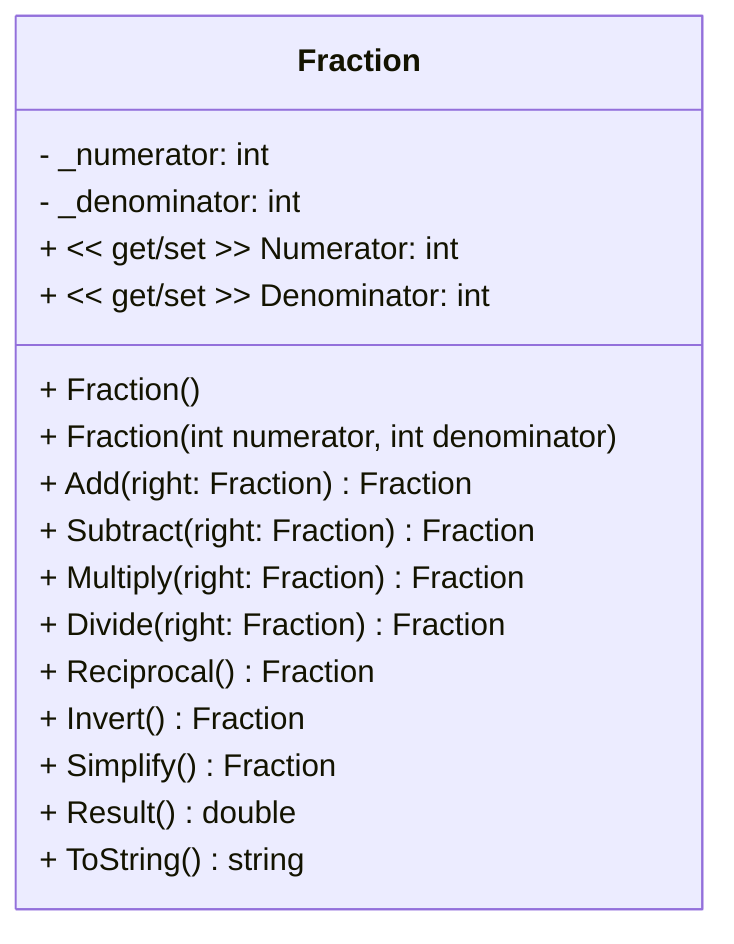

<h1 align="center">Fractions Calculator</h1>

<p align="center">
Fractions program for Object Oriented Programming Evaluatie 3
</p>

## Table of Contents

- [Table of Contents](#table-of-contents)
- [Fractions Library](#fractions-library)
  - [Installation](#installation)
  - [UML Diagram](#uml-diagram)
    - [Atributes](#atributes)
    - [Properties](#properties)
    - [Constructors](#constructors)
    - [Methods](#methods)

## Fractions Library

The Fractions library is a simple library that allows you to perform basic arithmetic operations on fractions. The library provides a `Fraction` class that represents a fraction with a numerator and a denominator. The `Fraction` class provides methods to add, subtract, multiply, and divide fractions, as well as methods to simplify and invert fractions.

### Installation

To run this application you need to have the [.NET 6.0 SDK](https://dotnet.microsoft.com/download/dotnet/6.0) and [Visual Studio](https://visualstudio.microsoft.com/) installed on your machine.

The [FractionsLibrary](./FractionsLibrary/) is also published to [NuGet](https://www.nuget.org/packages/SimonStnnFractions). You can install it using the following command:

```bash
dotnet add package SimonStnnFractions --version 1.0.0
```

### UML Diagram



#### Atributes

- `_numerator`: The numerator of the fraction.
- `_denominator`: The denominator of the fraction.

#### Properties

- `Numerator`: The property to get and set the numerator of the fraction.
- `Denominator`: The property to get and set the denominator of the fraction.

#### Constructors

- `Fraction()`: The default constructor that initializes the fraction to `1/1`.
- `Fraction(int numerator, int denominator)`: The constructor that initializes the fraction to the given numerator and denominator.

#### Methods

- `Add(right: Fraction) Fraction`: Adds the given fraction to the current fraction. Returns a new fraction.
- `Subtract(right: Fraction) Fraction`: Subtracts the given fraction from the current fraction. Returns a new fraction.
- `Multiply(right: Fraction) Fraction`: Multiplies the given fraction with the current fraction. Returns a new fraction.
- `Divide(right: Fraction) Fraction`: Divides the current fraction by the given fraction. Returns a new fraction.
- `Reciprocal() Fraction`: Returns the reciprocal of the current fraction as a new fraction.
- `Invert() Fraction`: Inverts the current fraction.
- `Simplify() Fraction`: Simplifies the current fraction.
- `Result() double`: Returns the result of the fraction as a double.
- `ToString() string`: Returns the string representation of the fraction in the format `numerator/denominator`. (e.g. `1/2`)
