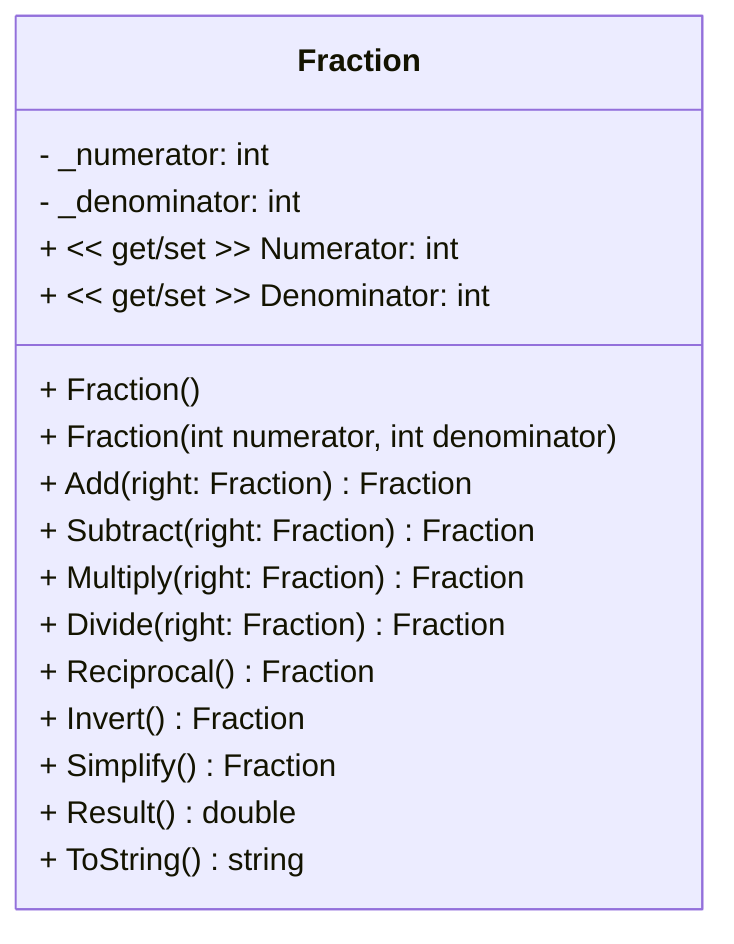
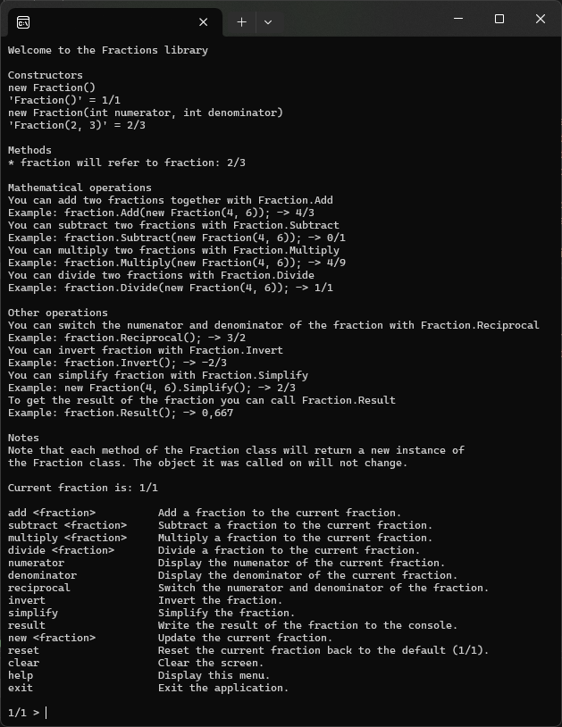
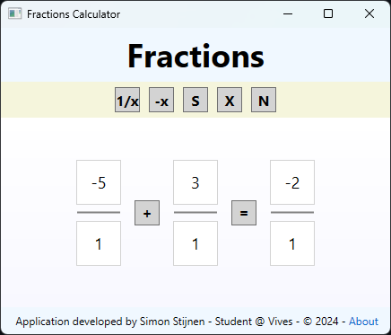
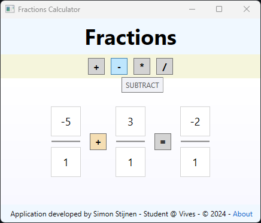
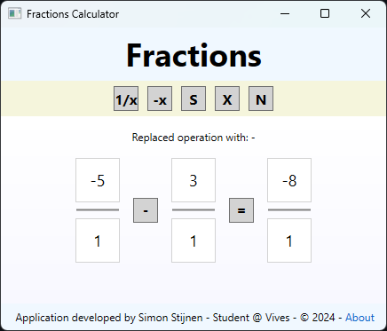
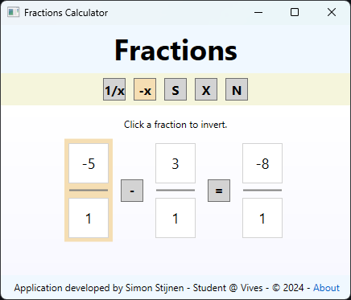
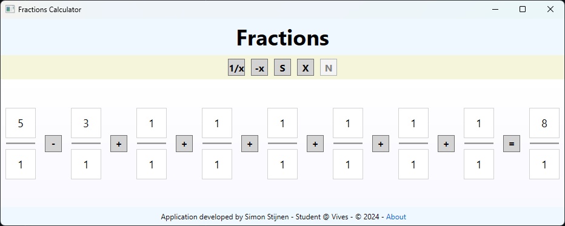
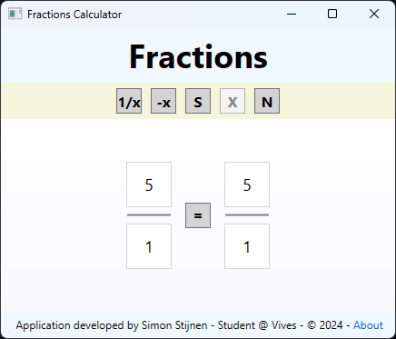

<h1 align="center">Fractions Calculator</h1>

<p align="center">
Fractions program for Object Oriented Programming Evaluatie 3
</p>

<https://github.com/SimonStnn/fractions/assets/113850648/cba95a9d-36fa-4e62-b397-9790e10c5835>

> This is a demo of the [WPF Fraction calculator](#wpf-application).

## Table of Contents

- [Table of Contents](#table-of-contents)
- [Author](#author)
- [Assignement](#assignement)
- [Fractions Library](#fractions-library)
  - [Installation](#installation)
  - [Usage](#usage)
  - [UML Diagram](#uml-diagram)
    - [Atributes](#atributes)
    - [Properties](#properties)
    - [Constructors](#constructors)
    - [Methods](#methods)
- [Console Application](#console-application)
- [WPF Application](#wpf-application)
- [xUnit Tests](#xunit-tests)

## Author

This application was created by [Simon Stijnen](https://github.com/SimonStnn). Student at [Vives University Of Applied Sciences](https://www.vives.be/nl/over-vives/campussen/vives-brugge-xaverianenstraat). Studying [Electronics - ICT](https://www.vives.be/nl/technology/elektronica-ict).

## Assignement

This project is the 3rd assignment for the Object Oriented Programming course. The assignment details can be found in the [assignment PDF](./Assignment%20Permanente%20evaluatie%203.pdf).

## Fractions Library

The Fractions library is a simple library that allows you to perform basic arithmetic operations on fractions. The library provides a `Fraction` class that represents a fraction with a numerator and a denominator. The `Fraction` class provides methods to add, subtract, multiply, and divide fractions, as well as methods to simplify and invert fractions.

### Installation

To run this application you need to have the [.NET 6.0 SDK](https://dotnet.microsoft.com/download/dotnet/6.0) and [Visual Studio](https://visualstudio.microsoft.com/) installed on your machine.

The [FractionsLibrary](./FractionsLibrary/) is also published to [NuGet](https://www.nuget.org/packages/SimonStnnFractions). You can install it using the following command:

```bash
dotnet add package SimonStnnFractions --version 1.0.0
```

For more installation options, please refer to the [NuGet package page](https://www.nuget.org/packages/SimonStnnFractions).

### Usage

To use the library in your project, add the following `using` directive to your code:

```csharp
using FractionsLibrary;
```

You can then create a new `Fraction` object and perform arithmetic operations on it:

Here is an example of how to use the Fractions library:

```csharp
Fraction a = new Fraction(1, 2);
Fraction b = new Fraction(1, 3);

Fraction c = a.Add(b);
Fraction d = a.Subtract(b);
Fraction e = a.Multiply(b);
Fraction f = a.Divide(b);

Console.WriteLine($"a = {a}"); // Output: a = 1/2
Console.WriteLine($"b = {b}"); // Output: b = 1/3
Console.WriteLine($"a + b = {c}"); // Output: a + b = 5/6
Console.WriteLine($"a - b = {d}"); // Output: a - b = 1/6
Console.WriteLine($"a * b = {e}"); // Output: a * b = 1/6
Console.WriteLine($"a / b = {f}"); // Output: a / b = 3/2
```

### UML Diagram



#### Atributes

- `_numerator`: The numerator of the fraction.
- `_denominator`: The denominator of the fraction.

#### Properties

- `Numerator`: The property to get and set the numerator of the fraction.
- `Denominator`: The property to get and set the denominator of the fraction.

#### Constructors

- `Fraction()`: The default constructor that initializes the fraction to `1/1`.
- `Fraction(int numerator, int denominator)`: The constructor that initializes the fraction to the given numerator and denominator.

#### Methods

- `Add(right: Fraction) Fraction`: Adds the given fraction to the current fraction. Returns a new fraction.
- `Subtract(right: Fraction) Fraction`: Subtracts the given fraction from the current fraction. Returns a new fraction.
- `Multiply(right: Fraction) Fraction`: Multiplies the given fraction with the current fraction. Returns a new fraction.
- `Divide(right: Fraction) Fraction`: Divides the current fraction by the given fraction. Returns a new fraction.
- `Reciprocal() Fraction`: Returns the reciprocal of the current fraction as a new fraction.
- `Invert() Fraction`: Inverts the current fraction.
- `Simplify() Fraction`: Simplifies the current fraction.
- `Result() double`: Returns the result of the fraction as a double.
- `ToString() string`: Returns the string representation of the fraction in the format `numerator/denominator`. (e.g. `1/2`)

## Console Application

The [FractionsConsoleApp](./FranctionsConsoleApp/) is a simple console application that demonstrates the usage of the Fractions library. The application is a CLI calculator that allows the user to perform basic arithmetic operations on fractions.

When starting the application you will be greeted with the following menu:



It first displays a note about the `Fraction` class and the current fraction, which is initialized to `1/1`. It then displays a list of commands that you can use to perform arithmetic operations on fractions.

After the menu, it displays a prompt `1/1 >`. This is the currect fraction you will perform operations on. You can then enter a command followed by a fraction to perform an operation. For example, to add `1/2` to the current fraction, you can enter `add 1/2`.

```plaintext
1/1 > add 1/2
3/2 >
```

As a result we got `3/2` which is the result of `1/1 + 1/2`. Other operations can be performed in the same way.

You can also display info about the current fraction by entering `numerator` or `denominator`:

```plaintext
3/2 > numerator
3
3/2 > denominator
2
3/2 >
```

To switch the numerator and denominator of the current fraction, you can enter `reciprocal`:

```plaintext
3/2 > reciprocal
2/3 >
```

Or you can invert the current fraction by entering `invert`:

```plaintext
2/3 > invert
-2/3 >
```

If you want to start over with a new fraction, you can enter `new <fraction>`. For example, to set the current fraction to `2/8`, you can enter `new 2/8`:

```plaintext
-2/3 > new 2/8
2/8 >
```

Now we can perform `simpify` to simplify the fraction:

```plaintext
2/8 > simplify
1/4 >
```

To display the result of the current fraction, you can enter `result`:

```plaintext
1/4 > result
0.25
1/4 >
```

Now you have a basic understanding of how to use the console application. You can explore more commands by entering `help` in the console.

## WPF Application

The [FractionsWpfApp](./FractionsWpfApp/) is a simple WPF application that demonstrates the usage of the Fractions library. The application is a GUI calculator that allows the user to perform basic arithmetic operations on fractions.

When starting the application you will be greeted with the following window:



The window has a basic fraction operation already set up. `3/4 + 1/2 = 5/4`. You can change the operation by entering new fractions in the text boxes and selecting an operation from the dropdown.

The result is always calculated automatically.

You can change the operation by clicking on it and then selecting a new operation from the operation options. Lets change the operation from `+` to `-`.



Now we have clicked the `+` operation it has been highlighted and we can now select the `-` operation. The result will be calculated automatically.



Now lets invert the first fraction. We can do this by clicking on the `-x` button and then clicking on the first fraction. After clicking on the `-x` button we see it gets highlighted and when we hover over the first fraction it also gets highlighted. When we click on the first fraction it will be inverted and the result will be calculated automatically.



We can also add a new fraction to the operation. We can do this by clicking on the `N` button. After clicking on the `N` button, `1/1` will be added. You can add up to 8 fractions.



If you want to remove a fraction you can click on the `X` button. After clicking on the `X` button the fraction will be removed. There always has to be at least one fraction in the operation.



You can test the other operations yourself by cloning this repo.

Have fun with the Fractions Calculator!

## xUnit Tests

The [FractionsTests](./FractionsTests/) project contains unit tests for the Fractions library. The main test class is `UnitTestFraction` in the `TestFractionLibrary` namespace.

Here are the tests included in the `UnitTestFraction` class:

- `TestConstructor`: Tests the constructor of the `Fraction` class.
- `TestProperties`: Tests the properties of the `Fraction` class.
- `TestAdd`: Tests the addition operation of the `Fraction` class.
- `TestSubtract`: Tests the subtraction operation of the `Fraction` class.
- `TestMultiply`: Tests the multiplication operation of the `Fraction` class.
- `TestDevide`: Tests the division operation of the `Fraction` class.
- `TestReciprocal`: Tests the reciprocal operation of the `Fraction` class.
- `TestInvert`: Tests the inversion operation of the `Fraction` class.
- `TestSimplify`: Tests the simplification operation of the `Fraction` class.
- `TestResult`: Tests the result operation of the `Fraction` class.
- `TestToString`: Tests the `ToString` method of the `Fraction` class.

Each test is marked with the `[Fact]` attribute, indicating that it is a test method that should be run by the test runner.

To run these tests, you can use the `dotnet test` command in the terminal, or use the test runner in Visual Studio.
